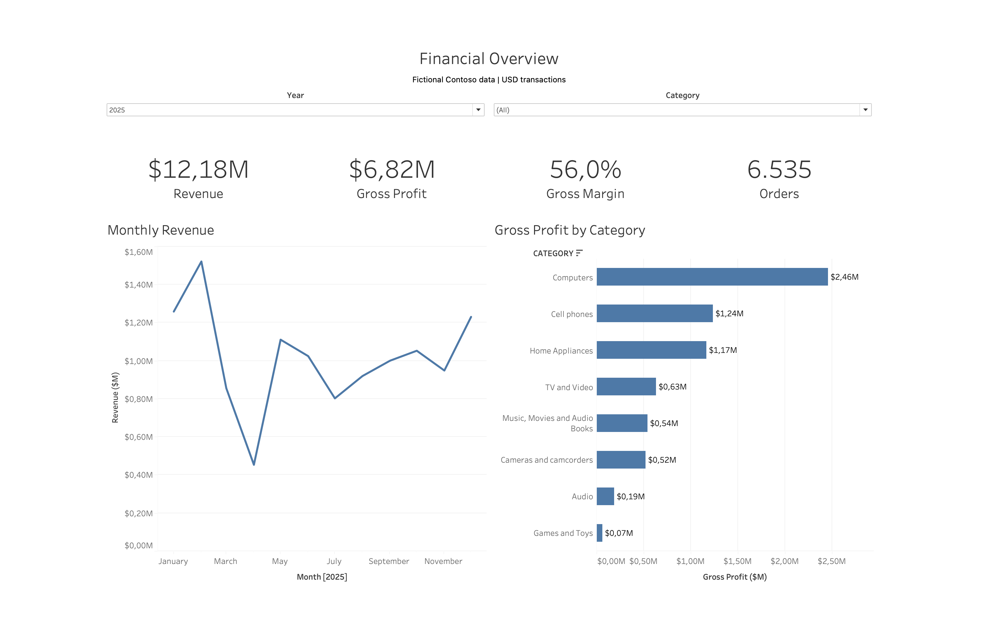
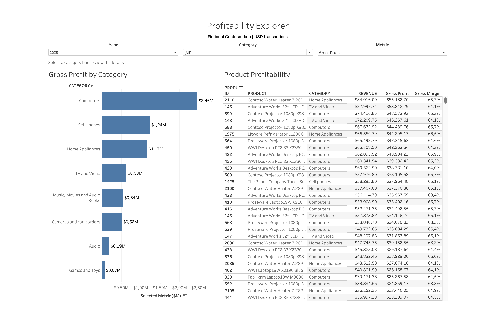
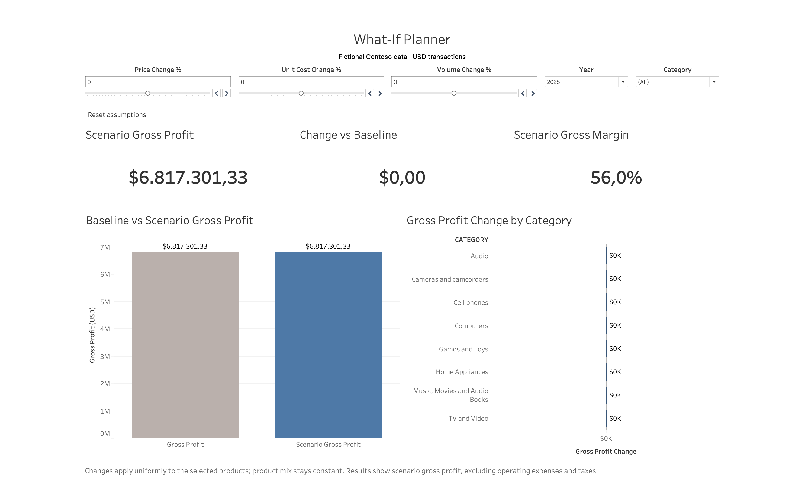

# Retail Profitability & What-If Planning

I built this project to explore retail gross profit and test how changes in price, unit cost and sales volume affect the result. It combines a DuckDB SQL model with three interactive Tableau dashboards.

[Open the interactive dashboard](https://public.tableau.com/views/Retail_Profitability/1FinancialOverview)

Portfolio website: coming soon.

## The dashboards

### Financial Overview

A summary of revenue, gross profit, gross margin, distinct orders and monthly trends. Year and Category controls let me look at a specific part of the business.



### Profitability Explorer

A closer look at category and product performance. The metric control switches between Revenue and Gross Profit, and selecting a category filters the product details.



### What-If Planner

Price, unit-cost and volume controls show how the selected assumptions affect gross profit and margin. The charts compare the scenario with the baseline and show the change by category. Reset assumptions returns the three inputs to zero while keeping Year and Category unchanged.



## Data and definitions

The source is SQLBI's **fictional Contoso dataset**, using `sales.csv`, `product.csv` and `store.csv` from the `csv-100k.7z` archive.

The analysis uses **USD transactions only**, with no currency conversion. One analytical row represents one sales order line.

| Measure | Definition |
|---|---|
| Revenue | Quantity × historical net unit price |
| Cost of goods sold (COGS) | Quantity × historical unit cost |
| Gross profit | Revenue − COGS |
| Gross margin | Total gross profit ÷ total revenue |
| Orders | Distinct order IDs |

Gross margin is calculated from the totals, rather than averaging individual line margins. Gross profit excludes operating expenses and taxes.

[Original dataset and download](https://github.com/sql-bi/Contoso-Data-Generator-V2-Data/releases/tag/ready-to-use-data)

## What I found

For **2025 USD transactions, all categories**, the SQL baseline was:

| Measure | Value |
|---|---:|
| Revenue | $12,176,250.37 |
| Gross profit | $6,817,301.33 |
| Gross margin | 56.0% |
| Distinct orders | 6,535 |

Computers contributed $2,460,913.02 in gross profit, about 36.1% of the total. Music, Movies and Audio Books had the highest category margin at 58.5%, but a smaller sales base. This helped me distinguish the size of a category's contribution from its margin percentage.

In the checked scenario, increasing price by 5% while keeping unit cost and volume unchanged produced gross profit of **$7,426,113.85**, an increase of **$608,812.52** from baseline.

This is a conditional scenario, not an observed business improvement. The model does not predict how customers would respond to the price change.

[Read the findings](analysis/findings.md) · [Dashboard checks](analysis/test_log.md) · [Scenario notes](analysis/scenario_note.md) · [Build log](analysis/build_log.md)

## How the scenario works

The planner applies percentage changes to the selected baseline:

- Scenario revenue = baseline revenue × (1 + price change ÷ 100) × (1 + volume change ÷ 100).
- Scenario COGS = baseline COGS × (1 + unit-cost change ÷ 100) × (1 + volume change ÷ 100).
- Scenario gross profit = scenario revenue − scenario COGS.
- Scenario margin = total scenario gross profit ÷ total scenario revenue.

Changes are applied uniformly across the selected products. Product mix stays constant, and volume is an assumption entered by the user.

## Checks

The seven SQL build scripts completed successfully during the repository review. All ten data-quality checks returned zero issues, and the CSV export matched the mart's row count and financial totals.

The baseline, price +5% and unit-cost +3% desktop cases passed. [The check log](analysis/test_log.md) keeps the recorded results and identifies the scenario and published-browser results still to add.

[Data-quality results](analysis/quality_checks.csv)

## Reproducing the project

You need the DuckDB command-line application, a tool that can extract a `.7z` archive, and Tableau Public to open or rebuild the dashboards.

1. Download `csv-100k.7z` from the [official Contoso release](https://github.com/sql-bi/Contoso-Data-Generator-V2-Data/releases/tag/ready-to-use-data).
2. Extract it and place the original `sales.csv`, `product.csv` and `store.csv` in `data/raw/`. Keep their filenames and contents unchanged.
3. Open a terminal in this repository's root folder.
4. Run the commands below in order. Every script uses the same DuckDB database. Stop and resolve any error before continuing.

```bash
mkdir -p data/raw data/processed

duckdb -bail data/retail.duckdb < sql/01_load_raw.sql
duckdb -bail data/retail.duckdb < sql/02_stage_sales.sql
duckdb -bail data/retail.duckdb < sql/03_stage_dimensions.sql
duckdb -bail data/retail.duckdb < sql/04_quality_checks.sql
duckdb -bail data/retail.duckdb < sql/05_build_mart.sql
duckdb -bail data/retail.duckdb < sql/06_answer_questions.sql
duckdb -bail data/retail.duckdb < sql/07_export.sql
```

The build produces `data/processed/retail_sales_usd.csv` for Tableau and `analysis/quality_checks.csv` for the validation record. Check that all ten issue counts are zero and that the export check reports a pass.

To rebuild the Tableau connection, use `data/processed/retail_sales_usd.csv`. The existing [packaged workbook](dashboard/Retail_Profitability.twbx) contains the dashboards and an extract.

`sql/00_scratch.sql` contains exploratory work and is not part of the build sequence.

## Limitations

- The dataset is fictional, so the findings describe this sample rather than an actual retailer.
- The USD-only scope leaves out transactions in other currencies.
- Gross profit includes product costs but excludes operating expenses and taxes.
- The scenarios apply uniform changes, keep product mix constant, and do not account for inventory limits or customer demand response.
- A modelled gain is useful for exploring assumptions; it does not establish that a real business would achieve the same result.

## Tools

DuckDB, SQL, Tableau Public, VS Code and GitHub. The portfolio website is being prepared for GitHub Pages.

Built by Fernanda Adekeu Alif.

